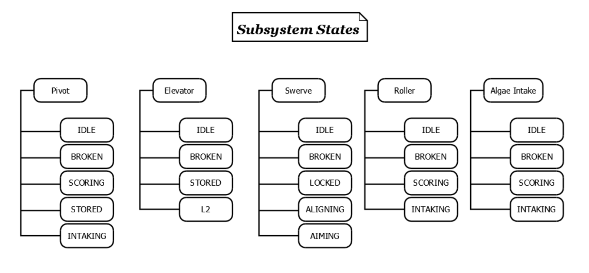

# FRC Team 1991 The Dragons - 2025 Robot Code

You can find a complete guide to both the software and some hardware on the robot in this repository. I use/created my own style controlling the robot. There is a combined subsystem and finite state machine controls systems at use. Look [here](#substates) for more information. [Contact information](#link-tree) will be left below, so feel free to reach out! Team 1991 will be competing in two district events this year. We will be attending [Hartford](https://www.thebluealliance.com/event/2025cthar) and [Waterbury](https://www.thebluealliance.com/event/2025ctwat) as our two district events. We ended up also attending [NEDCMP](https://www.thebluealliance.com/event/2025necmp1) and the [CT State Championship](https://www.thebluealliance.com/event/2025ctgla). See how we did this season [below](#season-results)!

## Season Results

 - **Waterbury:** We got picked by the number one seed and won the event! We also won the imagery award.
 - **Hartford:** We got picked by the number 4 alliance
 - **NEDCMP:** While we didn't get picked, we set our best winning record in team history!
 - **CT State Championship:** We got picked by the number two alliance and were finalists!

### Fun fact

We peaked as the 4th best processor bot in the world during NEDCMP and settled to the 6th best by the end of the season according to statbotics.

## Substates

Each subsystem on the robot has a series of states (substates) that defines all of its possible behaviors. These substates are then used by the manager to create robot states. Below is a list of all of the subsystems of the robot and their corresponding substates.

## Link tree

 - [frc1991dragons@gmail.com](mailto:frc1991dragons@gmail.com)
 - [Instagram](https://www.instagram.com/frcteam1991)
 - [Blue Alliance](https://www.thebluealliance.com/team/1991)
 - [Github](https://github.com/frc1991)
 - [Twitter](https://twitter.com/frcteam1991)
 - [Youtube](https://www.youtube.com/channel/UCPo0HSI_RKmutuLvsCoKSAg)
